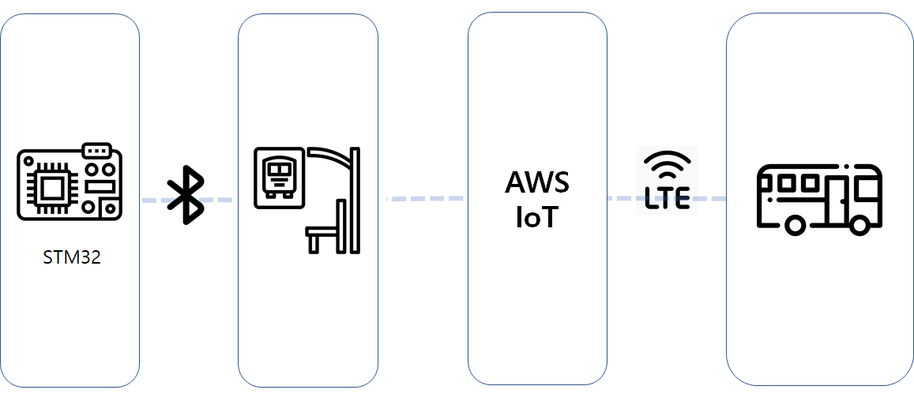

# 프로젝트명: BUS CATCHER
# 개요
본 프로젝트는 노약자, 임산부, 아동 등 버스를 놓치기 쉬운 교통약자들을 위한 버스 탑승 의사 알리미를 목적으로 합니다.

# 작동 과정
1. 교통약자들은 STM32 기반의 웨어러블 단말기를 장비합니다.
2. 손을 흔드는 제스처를 취하면 AI 학습 모델에 의해 단말기가 이를 인지합니다. 이후 단말기에서 BLE Beacon을 Advertising 모드로 송출합니다.
3. 버스 정류장의 버스 정보 시스템에 장착된 BLE 스캐너에서 Beacon 신호를 수신하고 해당 Beacon의 UID가 등록된 UID인 경우 AWS IoT로 데이터를 발행합니다.
4. AWS IoT에 구독중인 버스의 단말기에서 데이터를 수신하고 버스 기사에게 버스 정류장에 교통약자가 존재함을 알리고 주의하게 합니다.

# 구성도

## 단말기 - BLE - 버스 정보 시스템 - AWS IoT - LTE - 버스

# 사용 언어
Python, C, C++

# 사용 기술
STM32Cube.AI, Tensorflow, Keras, AWS IoT, QT5, Google Cloud TTS

# 시연 영상
<iframe width="560" height="315" src="https://www.youtube.com/embed/4hIDGSzT3UQ" frameborder="0" allow="accelerometer; autoplay; clipboard-write; encrypted-media; gyroscope; picture-in-picture" allowfullscreen></iframe>

